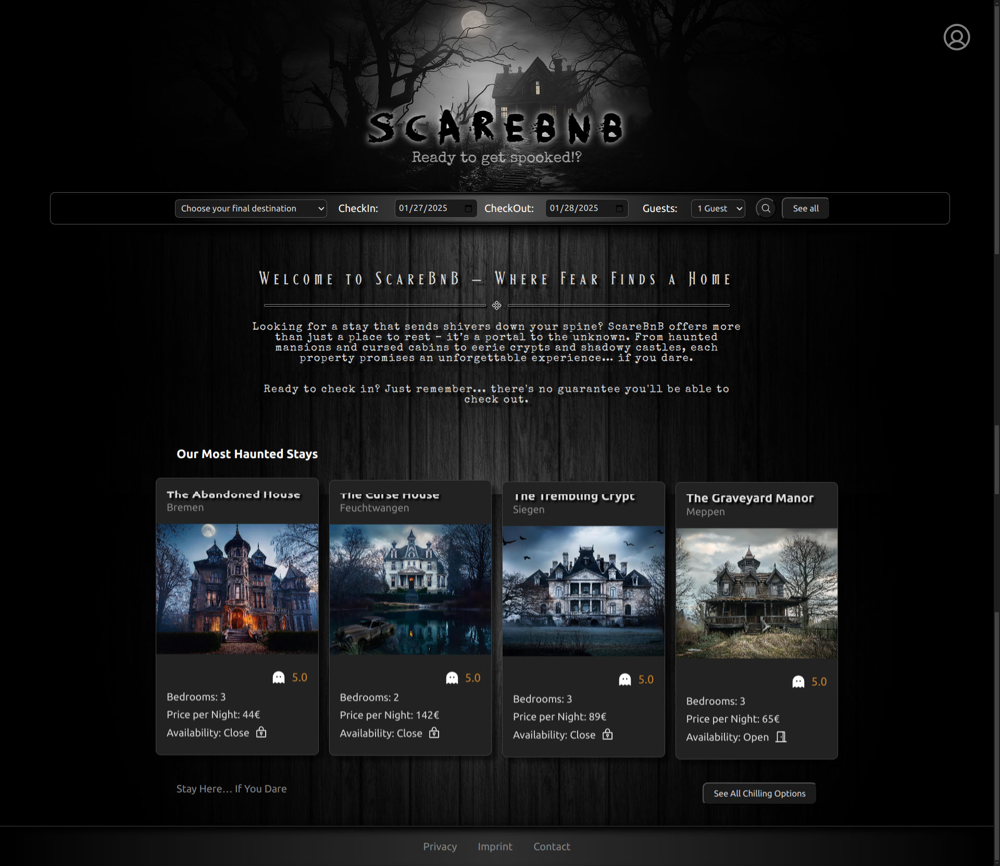

# ScareBnB

Welcome to ScareBnB, a spooky twist on the classic accommodation booking platform. This project was developed as part of a final project for the Digital Career Institute (DCI) Full Stack Developer program. It’s been an exciting few weeks filled with challenges and lots of fun, where we worked together and learned a lot.

## Our Team

This project was created by a talented group of developers who worked together to bring this chilling idea to life. Check out our team members below:

- [Manuel](https://github.com/Manolo1987)
- [Andreas](https://github.com/AndreasKnopf)
- [Kenneth](https://github.com/KennethLiese88)
- [Danny](https://github.com/dannykoehlerpoetsch)
- [Jana](https://github.com/j-grzy)

## What's This Project About?

ScareBnB is a full-stack accommodation booking website, but with a spooky twist! The platform allows users to:

- Browse, book, and favorite spooky accommodations
- View all available properties near your location via an interactive map
- Leave comments and ratings for hosts and properties
- Hosts can list their own creepy properties on the platform
- An admin dashboard to manage users and accommodations in one place

Basically, it’s a classic booking platform but for haunted houses, creepy cabins, and other mysterious places!

## Tech Stack

This project was built using the MERN stack, which includes:

- MongoDB for our database
- Express.js for the backend API
- React for the frontend
- Node.js for server-side runtime

## Screenshot of the Homepage

## Credits

A huge thank you to the following for their contributions:

- Map data from [OpenStreetMap](https://www.openstreetmap.org)
- Map style from [Stadia Maps](https://stadiamaps.com/)
- Icons by [Phosphor Icons](https://phosphoricons.com/)
- "Haunted" Font by [fg studios](https://www.fgstudios.net/haunted-pro-font/)
- "Face your Fear" Font by [David Kerkhoff](https://www.fontspace.com/david-kerkhoff)
- "Special Elite" Font by [Astigmatic](https://fonts.google.com/specimen/Special+Elite?query=special+elite)
- Music by [Mikhail Smusev](https://pixabay.com/users/sigmamusicart-36860929/?utm_source=link-attribution&utm_medium=referral&utm_campaign=music&utm_content=256309) from [Pixabay](https://pixabay.com//?utm_source=link-attribution&utm_medium=referral&utm_campaign=music&utm_content=256309)

## To Do / Future Improvements

There’s always room for improvement. Here are some features we plan to add or enhance:

- Improve accessibility (making it more user-friendly for everyone)
- Validate map coordinates when creating listings (implement geocoding)
- Enhance touch functionality for mobile users
- Implement real date management for bookings (to handle unavailable dates correctly)
